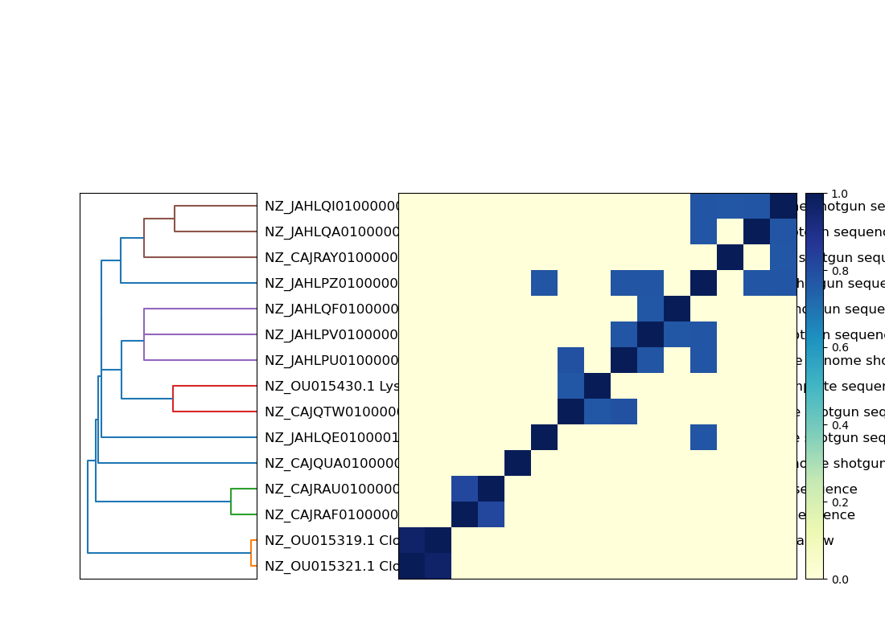
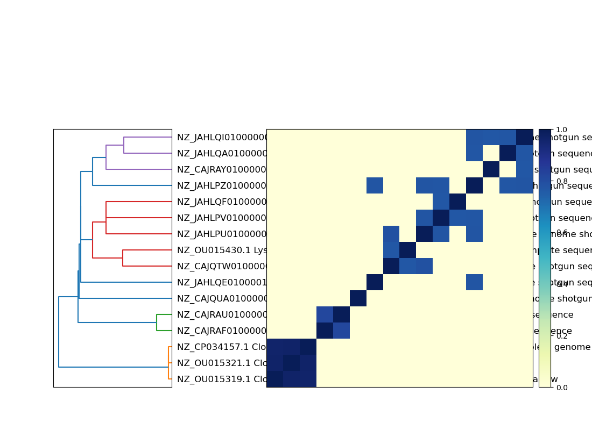

# Sourmash Tutorial

This tutorial covers [sourmash](https://sourmash.readthedocs.io/) for k-mer based analysis of genomic and metagenomic data.

We work with a single dataset throughout: a metagenomic sample together with 15 candidate reference genomes. The question we build toward is *which of those 15 genomes are actually present in the sample?* Here we build the sketching machinery with sourmash; in the [YACHT tutorial](TaxonomicProfiling-YACHT.md) we turn it into a statistical test.

---

# Installation

## Activation on Open OnDemand

If you are taking part in the workshop, use the following commands to activate the environment.

```bash
module load anaconda/2023.09
conda activate /storage/group/one/default/workshop/2025/envs/microbiome
```

Confirm sourmash is on your path before continuing:

```bash
sourmash --version
```

Anything 4.8 or newer will run every command in this tutorial.

## Full installation

These instructions are *only* if you would like to install it with conda elsewhere (eg. on the open queue, a personal computer, etc.). The basic steps are: load conda, create the environment, then install the tool:

```bash
module load anaconda3
conda create -y -n sourmash_env -c conda-forge -c bioconda yacht=1.3.2
conda activate sourmash_env
```

We install `yacht` rather than `sourmash` directly because `yacht` depends on `sourmash`, so this single environment covers both this tutorial and the YACHT one that follows.

## Set up directories and obtain the test data

Everything below runs from one working directory. Create it, download the demo dataset into it, and make a folder to hold the sketches we will build:

```bash
cd ~
mkdir -p sourmash_analysis    #<<-- main analysis folder
cd sourmash_analysis          #<<-- go inside this folder
yacht download demo --outfolder ./demo
mkdir -p sketches
```

This gives you:

```
sourmash_analysis/
|-- demo/
|   |-- query_data/query_data.fq      # a metagenomic sample (reads)
|   |-- ref_genomes/                   # 15 candidate reference genomes (GTDB)
|   |-- toy_genome_to_taxid.tsv        # maps each genome to a taxonomy ID
|-- sketches/                          # (empty; we will fill this in)
```

> **If `yacht download demo` fails or hangs.** It fetches a file listing through the GitHub REST API, which is rate-limited per IP address. When a whole workshop room runs it at once from the same cluster, some of you will get an error and an empty `demo/` folder. If that happens, use this instead — it pulls the same files as a single tarball and does not touch the rate-limited API:
>
> ```bash
> cd ~/sourmash_analysis
> curl -sL https://github.com/KoslickiLab/YACHT/archive/refs/heads/main.tar.gz \
>     | tar xz --strip-components=1 YACHT-main/demo
> mkdir -p sketches
> ```
>
> Verify either way with `ls demo/ref_genomes/ | wc -l`, which should print `15`.

The `demo` dataset is small and self-contained. The `query_data.fq` sample was simulated from 5 of the reference genomes at 0.5x coverage, so we have a known ground truth to check our answers against. The 15 reference genomes are randomly selected GTDB representatives.

All commands below assume you are in the top-level `sourmash_analysis/` directory.

---

# What is a sketch?

A genome or a metagenome is a very large set of k-mers (all substrings of length `k`). Comparing these sets directly is exact but expensive. A **sketch** is a small, representative subsample of that set that preserves the quantities we care about (similarity, containment) while being orders of magnitude smaller.

Sourmash uses **FracMinHash**: hash every k-mer, and keep only those hashes that fall below a fraction `1/scaled` of the hash space. With `scaled=1000` we keep, on average, 1 out of every 1000 distinct k-mers. Because the same k-mer always hashes to the same value, two samples that share a k-mer will both keep it (or both drop it), so overlap between sketches estimates overlap between the full sets.


Let's sketch a single reference genome and look at what we get:

```bash
sourmash sketch dna demo/ref_genomes/GCF_018918045.1_genomic.fna.gz \
    -p k=31,scaled=1000 -o sketches/one_genome.sig.zip
```

| Parameter | Description |
| --- | --- |
| `sourmash sketch dna` | Build a sketch from DNA sequence (use `protein` for amino-acid sequence). Input can be FASTA or FASTQ, gzipped or not. |
| `k=31` | k-mer size. Larger k is more specific; smaller k is more sensitive. |
| `scaled=1000` | Compression factor. Keep ~1/1000 of the distinct k-mers. Larger `scaled` = smaller sketch. |
| `-o` | Output signature file. |

Now inspect it:

```bash
sourmash sig describe sketches/one_genome.sig.zip
```

```
k=31 molecule=DNA num=0 scaled=1000 seed=42 track_abundance=0
size: 2452
```

That genome is about 2.45 Mbp, so its sketch of **2452 hashes** is roughly a 1000-fold compression, yet it is enough to accurately estimate how this genome relates to any other sketch built the same way.

**When is a sketch the right tool?** When you need fast set-level comparisons at scale: is this genome contained in that metagenome, how similar are these two samples, which of a million references does my sample match. Sketching is *not* the right tool when you need base-level detail, for example calling SNPs, recovering exact coordinates, or assembling. For those you keep the reads. The rule of thumb: sketch when you are asking "how much overlap," keep the reads when you are asking "what exactly is at this position."

**Two sketches can only be compared if they were built with the same `k` and are compatible in `scaled`.** Keep those consistent across a project.

---

# Sketch the whole reference set and the sample

Sketch all 15 reference genomes into one file, and sketch the metagenomic sample:

```bash
# 15 reference genomes -> one signature file
sourmash sketch dna demo/ref_genomes/*.fna.gz \
    -p k=31,scaled=1000 --name-from-first -o sketches/refs.sig.zip

# the metagenomic sample (reads work exactly the same as genomes)
sourmash sketch dna demo/query_data/query_data.fq \
    -p k=31,scaled=1000 --name query_metagenome -o sketches/query.sig.zip
```

Note that sketching reads is no different from sketching a genome: FracMinHash just hashes k-mers, whatever their source. The `--name-from-first` flag labels each reference signature by its first sequence header (a readable organism name), and `--name` gives the sample a label of our choosing.

The sample sketch takes the longest of anything in this tutorial — roughly 30 seconds, as it streams all 71,191 reads.

---

# Comparing sketches: containment and the ANI lesson

`sourmash compare` estimates the pairwise similarity between sketches. Two useful measures:

**Jaccard** (`--jaccard`) is the size of the intersection over the size of the union. It is symmetric, but it degrades when the two sets are very different in size (a small genome inside a large metagenome will have a tiny Jaccard even if it is fully present).

**Containment** (`--containment`) is the size of the intersection over the size of *one* of the sets: what fraction of A is found in B. It handles size asymmetry gracefully, which is exactly what we need for metagenomics.


## A vignette: why ANI beats raw containment

Two of our reference genomes are isolates of the same species, *Cloacibacterium caeni*. They are similar but not identical, which makes them a good illustration. Sketch each at three k-mer sizes and measure containment at each:

```bash
sourmash sketch dna demo/ref_genomes/GCF_907163105.1_genomic.fna.gz \
    -p k=21,k=31,k=51,scaled=1000 -o sketches/cc_105.sig.zip
sourmash sketch dna demo/ref_genomes/GCF_907163125.1_genomic.fna.gz \
    -p k=21,k=31,k=51,scaled=1000 -o sketches/cc_125.sig.zip

sourmash compare sketches/cc_105.sig.zip sketches/cc_125.sig.zip --containment -k 21
sourmash compare sketches/cc_105.sig.zip sketches/cc_125.sig.zip --containment -k 31
sourmash compare sketches/cc_105.sig.zip sketches/cc_125.sig.zip --containment -k 51
```

The containment of one isolate in the other drops sharply as k grows:

```
k=21:  37.3%
k=31:  27.9%
k=51:  16.7%
```

Nothing about the two genomes changed; only k did. The reason is that containment depends on k: it falls off roughly as `containment ~ ANI^k`, because a single mismatch destroys every k-mer that spans it, and longer k-mers are more likely to span a mismatch. So a raw containment value is not comparable across runs that used different k, and on its own it is hard to interpret biologically.

The fix is to invert that relationship. **Average Nucleotide Identity (ANI)** estimates the per-base identity between the two genomes as `ANI ~ containment^(1/k)`, which is largely independent of k. Add `--estimate-ani`:

```bash
sourmash compare sketches/cc_105.sig.zip sketches/cc_125.sig.zip --estimate-ani -k 21
sourmash compare sketches/cc_105.sig.zip sketches/cc_125.sig.zip --estimate-ani -k 31
sourmash compare sketches/cc_105.sig.zip sketches/cc_125.sig.zip --estimate-ani -k 51
```

```
k=21:  95.6%
k=31:  96.1%
k=51:  96.6%
```

The containment more than halved from k=21 to k=51, but the ANI stays put at about **96%** at every k. This is why we report and reason about ANI rather than raw containment: it is stable across k and it means something concrete, namely two genomes that are about 96% identical, i.e. two members of the same species. (Sourmash can also report confidence intervals on ANI with `--estimate-ani-ci`; the theory behind these estimates is in Hera, Pierce-Ward, and Koslicki 2023 [[3]](#references).)

Hold on to that 96% number. When we get to YACHT, its training step will decide whether two references are "the same organism" using an ANI threshold, and these two *Cloacibacterium* isolates will be exactly the kind of pair that gets collapsed.

---

# Searching the sample against the references

Now the payoff question: what is in the metagenome? The right tool is `sourmash gather`, which greedily explains the sample as a combination of reference genomes (a minimum-metagenome-cover):

```bash
sourmash gather sketches/query.sig.zip sketches/refs.sig.zip
```

```
overlap     p_query p_match
---------   ------- -------
0.8 Mbp       30.5%   34.4%    NZ_JAHLQE010000140.1 Eubacterium sp. MSJ-13 ...
0.6 Mbp       21.2%   18.4%    NZ_JAHLPV010000001.1 Acetivibrio sp. MSJd-27 ...
0.5 Mbp       19.2%   20.5%    NZ_JAHLPU010000070.1 Pseudoflavonifractor sp. MSJ-30 ...
314.0 kbp     12.0%    9.0%    NZ_JAHLQA010000007.1 Blautia sp. MSJ-19 ...
156.0 kbp      5.9%    5.4%    NZ_JAHLPZ010000001.1 Eubacterium sp. MSJ-21 ...

found 5 matches total;
the recovered matches hit 88.7% of the query k-mers (unweighted).
```

Gather recovers exactly 5 of the 15 references, and these are precisely the 5 genomes the sample was simulated from. `p_query` is the fraction of the sample explained by each match; `p_match` is the fraction of that reference seen in the sample.

`sourmash search` answers a slightly different question, ranking references by how much of the sample each one contains individually:

```bash
sourmash search sketches/query.sig.zip sketches/refs.sig.zip --containment
```

```
4 matches above threshold 0.080; showing first 3:
similarity   match
----------   -----
 30.5%       NZ_JAHLQE010000140.1 Eubacterium sp. MSJ-13 ...
 21.2%       NZ_JAHLPV010000001.1 Acetivibrio sp. MSJd-27 ...
 19.2%       NZ_JAHLPU010000070.1 Pseudoflavonifractor sp. MSJ-30 ...
```

Notice that `search` applies a default containment threshold of 0.08, which is enough to drop the lowest-abundance organism (*Eubacterium* sp. MSJ-21, at 5.9%) entirely, and it shows only the top few hits unless you ask for more. A hard threshold like this is convenient, but it is a blunt instrument: it treats 8% as the line between present and absent regardless of genome size, coverage, or how much confidence you actually have.

This is a good place to stop and notice what we do *not* yet have. Our sample was simulated at only 0.5x coverage, so every present genome is seen only partially, and the containment values are correspondingly low (6% to 31%). Gather and search will happily rank matches, but they lean on hard thresholds (a 50 kbp overlap cutoff, a 0.08 containment cutoff), and they give us no principled statement about how confident we should be that a genome is truly present versus a stray k-mer coincidence. Answering *that* question, with control over the false positive and false negative rates, is exactly what YACHT is for.

---

# Comparing many sketches at once

`sourmash compare` with a single argument builds the full all-vs-all matrix, and `sourmash plot` renders it as a dendrogram and heatmap:

```bash
sourmash compare sketches/refs.sig.zip --estimate-ani -k 31 -o sketches/refs_cmp
sourmash plot --labels sketches/refs_cmp --output-dir sketches
```

`sourmash plot` writes three PDFs — `refs_cmp.dendro.png`, `refs_cmp.matrix.png`, and `refs_cmp.hist.png`. Without `--output-dir` they land in whatever directory you ran the command from, which is a common source of "where did my plot go?"

For our 15 references, 92 of the 105 off-diagonal entries are exactly zero — these are distinct GTDB species with no meaningful k-mer overlap — and there is a single genuinely hot pair at about 96% ANI: the two *Cloacibacterium caeni* isolates from the vignette above.

You will also see a scattering of mid-range cells around 60-80%. Do not over-read these. They come from pairs sharing only a handful of hashes, and because ANI is estimated as roughly `containment^(1/k)`, taking the 31st root of a very small number pushes it deceptively close to 1. It is the same lesson as the vignette, seen from the other side: ANI is the right scale for comparing genomes that genuinely overlap, but it is not a reliable signal when the intersection is nearly empty. If you want to see the raw picture, rerun without `--estimate-ani` and note that only one off-diagonal pair exceeds a Jaccard of 0.01.

## To view the images

On Open OnDemand, the easiest route is the **Files** browser: navigate to `~/sourmash_analysis/sketches/` and click an image to view it.

You should see a plot that looks like:



---

# A detour: automating this with Snakemake

Everything so far has been commands typed by hand, in order, once. That is fine for a tutorial. It stops being fine the moment a collaborator hands you a sixteenth genome, because now you have to remember which commands to re-run, in what order, and which outputs are quietly stale. This is the single most common source of irreproducible results in bioinformatics: not a bad algorithm, but a plot built from an out-of-date intermediate file.

**Snakemake** is a workflow manager that solves this. You describe your analysis as a set of **rules**, each declaring its `input` files, its `output` files, and the `shell` command that turns one into the other. You never specify an order. Snakemake reads the rules, notices that one rule's output is another's input, and builds the dependency graph itself. Then, given a target you want, it works *backwards* and runs only the steps whose outputs are missing or older than their inputs.

Three consequences make it worth the ten minutes it takes to learn:

| | |
| --- | --- |
| **Nothing is re-computed needlessly** | Change one input and only the affected part of the graph re-runs. |
| **Parallelism is free** | Independent jobs are dispatched across cores automatically with `--cores N`. |
| **The workflow is the documentation** | The Snakefile *is* the record of what was run. It replaces the paragraph in your methods section that starts "we then ran sourmash with default parameters." |

Snakemake is written in Python, and a Snakefile is a Python file with some extra syntax, so anything you can compute in Python you can use to build your workflow.

> **Check that it is installed** before continuing:
>
> ```bash
> snakemake --version
> ```
>
> If that errors, `conda install -c conda-forge -c bioconda snakemake-minimal` into your environment.

## The Snakefile

We will rebuild the sketch → compare → plot pipeline from the last section as a workflow. One change from what we did by hand: instead of sketching all 15 genomes in a single `sourmash sketch` call, we sketch each genome into its own signature file and then stitch them together with `sourmash sig cat`. The result is identical — `sourmash sketch dna a.fna.gz b.fna.gz -o out.zip` already produces one signature per input file — but splitting it up is what lets Snakemake see the genomes individually, and therefore skip the fifteen it has already done.

The workflow builds everything into its own fresh directory, `snakemake_output/`, rather than reusing the `sketches/` files you made by hand. A workflow that regenerates every one of its outputs from scratch is easier to reason about — and it means Snakemake genuinely has all 19 steps to run the first time, so you can watch the dependency graph come to life.

Save this as `Snakefile` in your `sourmash_analysis/` directory:

```python
# Snakefile -- sketch every reference genome, merge, compare, plot.

REF_DIR = "demo/ref_genomes"
OUT_DIR = "snakemake_output"
KSIZE   = 31
SCALED  = 1000

# Look in REF_DIR and pull out the name of every genome sitting there.
GENOMES, = glob_wildcards(REF_DIR + "/{genome}.fna.gz")
GENOMES  = sorted(GENOMES)


# The final products we want. Snakemake works backwards from here.
rule all:
    input:
        expand(OUT_DIR + "/refs_cmp.{plot}.png",
               plot=["matrix", "dendro", "hist"])


# One sketch per genome. The {genome} wildcard makes this a template.
rule sketch_genome:
    input:
        REF_DIR + "/{genome}.fna.gz"
    output:
        OUT_DIR + "/individual/{genome}.sig.zip"
    params:
        k=KSIZE, scaled=SCALED
    shell:
        "sourmash sketch dna {input} "
        "-p k={params.k},scaled={params.scaled} "
        "--name-from-first -o {output}"


# Collect the individual sketches into a single refs.sig.zip.
rule merge_sketches:
    input:
        expand(OUT_DIR + "/individual/{genome}.sig.zip", genome=GENOMES)
    output:
        OUT_DIR + "/refs.sig.zip"
    shell:
        "sourmash sig cat {input} -o {output}"


rule compare:
    input:
        OUT_DIR + "/refs.sig.zip"
    output:
        matrix=OUT_DIR + "/refs_cmp",
        labels=OUT_DIR + "/refs_cmp.labels.txt"
    params:
        k=KSIZE
    shell:
        "sourmash compare {input} --estimate-ani -k {params.k} -o {output.matrix}"


rule plot:
    input:
        matrix=OUT_DIR + "/refs_cmp",
        labels=OUT_DIR + "/refs_cmp.labels.txt"
    output:
        multiext(OUT_DIR + "/refs_cmp",
                 ".matrix.png", ".dendro.png", ".hist.png")
    params:
        outdir=OUT_DIR
    shell:
        "sourmash plot --labels {input.matrix} --output-dir {params.outdir}"
```

Four ideas are doing all the work here:

| Concept | What it does |
| --- | --- |
| `glob_wildcards` | Scans the filesystem *right now* and extracts the part of each filename matching `{genome}`. This is what makes the workflow notice new files. |
| Wildcards (`{genome}`) | `sketch_genome` is a template, not one job. Snakemake instantiates it once per genome and fills in `{input}` and `{output}` accordingly. |
| `expand` | Expands a template over a list, turning one pattern into the 15 filenames `merge_sketches` depends on. |
| `rule all` | By convention the first rule, listing the final targets. Snakemake builds whatever `rule all` asks for and nothing else. |

Note that `compare` declares `refs_cmp.labels.txt` as an output even though we never name it on the command line. `sourmash compare` writes it as a side effect, and `sourmash plot` needs it. Declaring every file a rule actually produces is good hygiene: it tells Snakemake to check for the file, and to clean it up if the job fails halfway.

## Run it

Dry-run first. `-n` prints the plan without executing anything, which is the habit worth forming:

```bash
snakemake -n --cores 4
```

Then run it:

```bash
snakemake --cores 4
```

```
Building DAG of jobs...
Job stats:
job               count
--------------  -------
sketch_genome        15
merge_sketches        1
compare               1
plot                  1
all                   1
total                19
```

Nineteen jobs, and the fifteen `sketch_genome` jobs are independent so they run four at a time. You end up with the same `refs_cmp.matrix.png` you produced by hand in the previous section — now in `snakemake_output/`, rebuilt automatically — plus a `snakemake_output/individual/` directory holding the per-genome signatures.

Now run the exact same command again:

```bash
snakemake --cores 4
```

```
Building DAG of jobs...
Nothing to be done (all requested files are present and up to date).
```

Everything is current, so nothing runs. This is the property we are about to exploit.

## Add a genome and re-run

Grab a sixteenth genome — a complete *Cloacibacterium normanense* chromosome — and drop it into the reference directory:

```bash
wget -P demo/ref_genomes/ \
  https://raw.githubusercontent.com/Penn-State-Microbiome-Center/KickStart-Workshop-2026/main/Day3-Shotgun/Data/NZ_CP034157.1_Cloacibacterium.fna.gz
```


We changed nothing about the Snakefile. Ask Snakemake what it now intends to do:

```bash
snakemake -n --cores 4
```

```
Job stats:
job               count
--------------  -------
sketch_genome         1
merge_sketches        1
compare               1
plot                  1
all                   1
total                 5

rule sketch_genome:
    input: demo/ref_genomes/NZ_CP034157.1_Cloacibacterium.fna.gz
    output: snakemake_output/individual/NZ_CP034157.1_Cloacibacterium.sig.zip
    reason: Missing output files: ...; Updated input files: ...
    wildcards: genome=NZ_CP034157.1_Cloacibacterium
```

Five jobs instead of nineteen. One sketch, not sixteen. The fifteen existing signatures are already on disk and up to date, so Snakemake leaves them alone; the merge, comparison, and plot all sit downstream of a changed file, so those do re-run. Note the `reason:` line — Snakemake explains every job it schedules, which makes debugging a workflow far less mysterious than debugging a shell script.

Run it:

```bash
snakemake --cores 4
```

```
5 of 5 steps (100%) done
```

The first run took roughly 20 seconds; this one takes about 4. On a real reference set of ten thousand genomes, that ratio is the difference between an afternoon and a coffee break.

## What changed in the plot

Open `snakemake_output/refs_cmp.matrix.png`. The two-genome *Cloacibacterium caeni* block from the previous section is now a three-genome block:



The new *C. normanense* genome lands at about **96.3%** and **96.1%** estimated ANI against the two *C. caeni* isolates, right alongside the 96.1% those two isolates share with each other. And the signal is real rather than an artifact of the `containment^(1/k)` inflation we warned about above: the raw Jaccard for all three *Cloacibacterium* pairs is between 0.17 and 0.19, while every other pair in the matrix is below 0.001. The count of exactly-zero off-diagonal cells goes from 92 of 105 to 105 of 120 — the only two new nonzero cells in the entire matrix are the two *normanense*–*caeni* pairs.

That is the whole point of the exercise. You added a file. You re-ran one command. The sketching, the merge, the all-pairs comparison, and the figure all updated themselves, and nothing that did not need to be recomputed was recomputed.

## Three flags worth remembering

| Flag | Why |
| --- | --- |
| `-n` (`--dry-run`) | Always. Shows the plan and the reason for every job before anything executes. |
| `--cores N` | Required. Sets how many jobs run concurrently. |
| `-p` | Prints the actual shell command for each job, which is how you catch a mis-quoted parameter. |

Snakemake goes considerably further than this — per-rule conda environments, cluster and cloud submission (it can hand each job to Slurm on Roar for you), config files, logging, and containerization. The [Snakemake documentation](https://snakemake.readthedocs.io/) and its [official tutorial](https://snakemake.readthedocs.io/en/stable/tutorial/tutorial.html) are the place to go next.

---


---

# Further exploration

- The canonical [sourmash tutorial](https://sourmash.readthedocs.io/en/latest/tutorial-basic.html) works through reads-vs-assembly containment and searching a 50-strain *E. coli* database.
- `sourmash sketch` can track k-mer abundance (`-p ...,abund`), which lets `gather` report relative abundances. We use this in the YACHT tutorial to decorate presence/absence calls with abundances.
- FracMinHash sketches are a general-purpose tool: the same machinery underlies ANI estimation, cosine-similarity and other metric estimation, dN/dS estimation, and functional profiling. See the workshop slides for references.

---

# References

<a name="references"></a>

[1] Irber, L., et al. (2024). sourmash v4: A multitool to quickly search, compare, and analyze genomic and metagenomic data sets. Journal of Open Source Software, 9(98), 6830. <https://doi.org/10.21105/joss.06830>

[2] Koslicki, D., & Zabeti, H. (2019). Improving MinHash via the containment index with applications to metagenomic analysis. Applied Mathematics and Computation, 354, 206-215.

[3] Hera, M. R., Pierce-Ward, N. T., & Koslicki, D. (2023). Deriving confidence intervals for mutation rates across a wide range of evolutionary distances using FracMinHash. Genome Research, 33(7), 1061-1068.

---

# Please proceed to the [YACHT Section](TaxonomicProfiling-YACHT.md)
